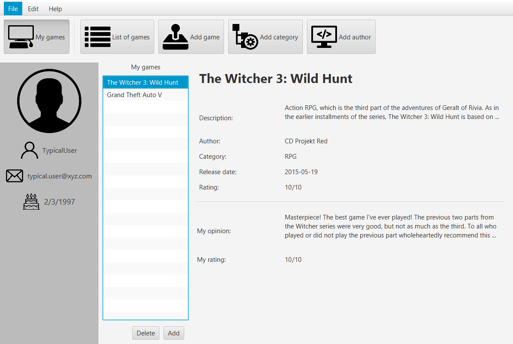

# My Games Library
Simple window application created with java 8, javaFX and H2 Database

## Table of contents
* [General info](#general-info)
* [Technologies](#technologies)
* [Detailed informations](#detailed-description-of-the-application)

## General info
My Games Library is an application in which every user has their own game libraries.
He can add games to it, in which he played or wants to play.
The user adding the game to the library can evaluate it and write a comment.

This application is available in three languages:
* Polish, 
* English 
* German

## Technologies
Project is created with:
* Java 8
* JavaFX
* H2 database 1.4.193
* OrmLite 5.0

## Detailed description of the application

The appearance of the login panel and registration panel. 
During registration, the new user can choose the language in which the application will be displayed.

After logging in, the user can go to the My games panel, in which there is a list of games added to the library. 
After selecting a game from the list, all information about this game is displayed.

